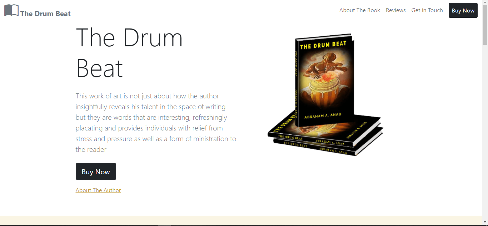

# The Drum Beat Book Store

A website created to promote and sell 'The Drum Beat Book'.

## Motivation

This project is for a friend who was looking for a simple solution to sell and promote a book he had written.

## Screenshot

## URL

The drum beat book Store [The Drum Beat Book](https://master--wizardly-swartz-760938.netlify.app/).

## Installation

1. Clone Repo

## Tech/framework used

1. HTML5
2. CSS3
3. Bootstrap 5
4. SASS
5. Netlify

## Contributing

Pull requests are welcome. For major changes, please open an issue first to discuss what you would like to change.

## License

[MIT](https://choosealicense.com/licenses/mit/)
